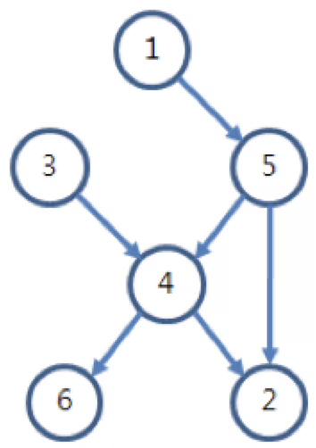

## 문제 설명
1번부터 N번까지 번호가 붙여져 있는 학생들에 대하여 두 학생끼리 키를 비교한 결과의 일부가 주어져 있다. 단, N명의 학생들의 키는 모두 다르다고 가정한다. 예를 들어, 6명의 학생들에 대하여 6번만 키를 비교하였고, 그 결과가 다음과 같다고 하자.

- 1번 학생의 키 < 5번 학생의 키
- 3번 학생의 키 < 4번 학생의 키
- 5번 학생의 키 < 4번 학생의 키
- 4번 학생의 키 < 2번 학생의 키
- 4번 학생의 키 < 6번 학생의 키
- 5번 학생의 키 < 2번 학생의 키

1번은 5번보다 키가 작고, 5번은 4번보다 작기 때문에, 1번은 4번보다 작게 된다. 그러면 1번, 3번, 5번은 모두 4번보다 작게 된다. 또한 4번은 2번과 6번보다 작기 때문에, 4번 학생은 자기보다 작은 학생이 3명이 있고, 자기보다 큰 학생이 2명이 있게 되어 자신의 키가 몇 번째인지 정확히 알 수 있다. 그러나 4번을 제외한 학생들은 자신의 키가 몇 번째인지 알 수 없다.

학생들의 키를 비교한 결과가 주어질 때, 자신의 키가 몇 번째인지 알 수 있는 학생들이 모두 몇 명인지 계산하여 출력하는 프로그램을 작성하시오.

## 입력
첫째 줄에 학생들의 수 N (2 ≤ N ≤ 500)과 두 학생 키를 비교한 횟수 M (0 ≤ M ≤ N(N-1)/2)이 주어진다.

다음 M개의 각 줄에는 두 학생의 키를 비교한 결과를 나타내는 N보다 작거나 같은 서로 다른 양의 정수 a와 b가 주어진다. 이는 번호가 a인 학생이 번호가 b인 학생보다 키가 작은 것을 의미한다.

## 출력
자신이 키가 몇 번째인지 알 수 있는 학생이 모두 몇 명인지를 출력한다.

### 예제

예제 입력 1  
6 6 
1 5 
3 4 
5 4 
4 2 
4 6 
5 2

예제 출력 1  
1

예제 입력 2  
6 7  
1 3  
1 5  
3 4  
5 4  
4 2  
4 6  
5 2

예제 출력 2 
2

예제 입력 3  
6 3  
1 2  
2 3  
4 5

예제 출력 3 
0