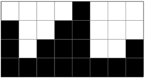

## 문제 설명
2차원 세계에 블록이 쌓여있다. 비가 오면 블록 사이에 빗물이 고인다.

비는 충분히 많이 온다. 고이는 빗물의 총량은 얼마일까?

## 입력
첫 번째 줄에는 2차원 세계의 세로 길이 H과 2차원 세계의 가로 길이 W가 주어진다. (1 ≤ H, W ≤ 500)

두 번째 줄에는 블록이 쌓인 높이를 의미하는 0이상 H이하의 정수가 2차원 세계의 맨 왼쪽 위치부터 차례대로 W개 주어진다.

따라서 블록 내부의 빈 공간이 생길 수 없다. 또 2차원 세계의 바닥은 항상 막혀있다고 가정하여도 좋다.

## 출력
2차원 세계에서는 한 칸의 용량은 1이다. 고이는 빗물의 총량을 출력하여라.

빗물이 전혀 고이지 않을 경우 0을 출력하여라.

### 예제

예제 입력 1  
4 4 
3 0 1 4

예제 출력 1  
5

예제 입력 2  
4 8 
3 1 2 3 4 1 1 2

예제 출력 2  
5

예제 입력 3  
3 5 
0 0 0 2 0

예제 출력 3 
0