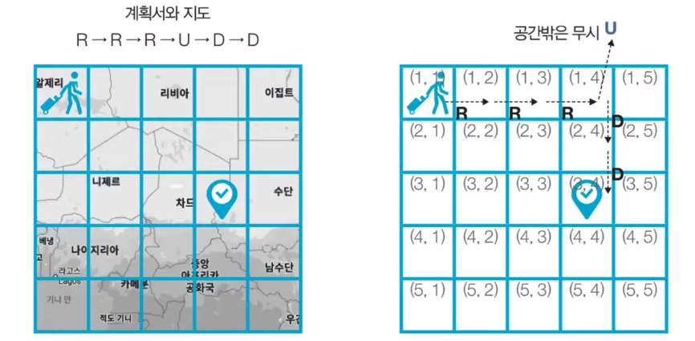

> 참고) 이것이 취업을 위한 코딩 테스트다. with python

## 문제 설명
여행가 A는 N × N 크기의 정사각형 공간 위에 서 있다. 이 공간은 1 × 1 크기의 정사각형으로 나누어져 있다.
가장 왼쪽 위 좌표는 (1, 1)이며, 가장 오른쪽 아래 좌표는 (N, N)에 해당한다.
여행가 A는 상, 하, 좌, 우 방향으로 이동할 수 있으며, 시작 좌표는 항상 (1, 1)이다. 우리 앞에는 여행가 A가
이동할 계획이 적힌 계획서가 놓여 있다

계획서에는 하나의 줄에 띄어쓰기를 기준으로 L, R, U, D 중 하나의 문자가 반복적으로 적혀있다.
각 문자의 의미는 다음과 같다

- L: 왼쪽으로 한 칸 이동
- R: 오른쪽으로 한 칸 이동
- U: 위로 한 칸 이동
- D: 아래로 한 칸 이동

이때 여행가 A가 N × N 크기의 정사각형 공간을 벗어나는 움직임은 무시된다.
예를 들어 (1, 1)의 위치에서 L 혹은 U를 만나면 무시된다.
다음은 N = 5인 지도와 계획이다.



## 제한 사항
- 첫째 줄에 공간의 크기를 나타내는 N이 주어진다. (1<=N<=100)
- 둘째 줄에 여행가 A가 이동할 계획서 내용이 주어진다. (1<=이동 횟수<=100)
- 첫째 줄에 여행가 A가 최종적으로 도착할 지점의 좌표 (X, Y)를 공백으로 구분하여 출력한다.

## 입출력 예
```
5
R R R U D D
# 3 4
```

## solution.py
``` python
n = int(input())
data = list(input().split())

result = ''
w = 1
h = 1
for step in data:
    if (step == 'R'):
        if (w + 1 <= n):
            w += 1
    elif (step == 'L'):
        if (w - 1 >= 1):
            w -= 1
    elif (step == 'U'):
        if (h - 1 >= 1):
            h -= 1
    elif (step == 'D'):
        if (h + 1 <= n):
            h += 1
result = str(h) + ' ' + str(w)
print(result)
```

## 문제 풀이
- 이 문제를 요구사항대로 구현하면 연산 횟수는 이동 횟수에 비례한다.
- 예를 들어 이동 횟수가 N번인 경우 시간 복잡도는 O(N)이다. 따라서 이 문제의 시간 복잡도는 매우 넉넉한 편이다.
- 이러한 문제는 일련의 명령에 따라서 개체를 차례대로 이동시킨다는 점에서 `시뮬레이션` 유형으로 분류되며 구현이 중요한 대표적인 문제 유형이다.

``` python
n = int(input())
x, y = 1, 1
plans = list(input().split())

# L, R, U, D에 따른 이동 방향
dx = [0, 0, -1, 1]
dy = [-1, 1, 0, 0]
move_types = ['L', 'R', 'U', 'D']

# 이동 계획을 하나씩 확인
for plan in data:
    # 이동 후 좌표 구하기
    for i in range(len(move_types)):
        if plan == move_types[i]:
            nx = x + dx[i]
            ny = y + dy[i]
    # 공간을 벗어나는 경우 무시
    if nx < 1 or ny < 1 or nx > n or ny > n:
        continue
    # 이동 수행
    x, y = nx, ny

print(result)
```