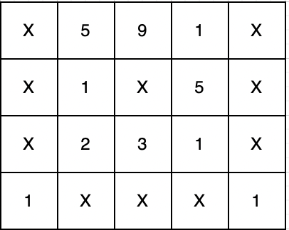
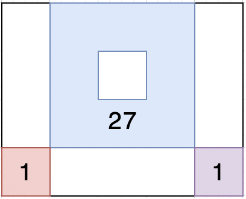
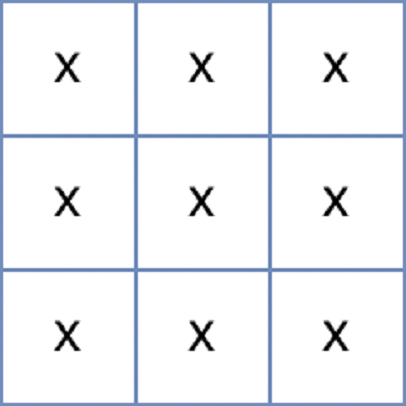

## 문제 설명
메리는 여름을 맞아 무인도로 여행을 가기 위해 지도를 보고 있습니다. 지도에는 바다와 무인도들에 대한 정보가 표시돼 있습니다. 지도는 1 x 1크기의 사각형들로 이루어진 직사각형 격자 형태이며, 격자의 각 칸에는 'X' 또는 1에서 9 사이의 자연수가 적혀있습니다. 지도의 'X'는 바다를 나타내며, 숫자는 무인도를 나타냅니다. 이때, 상, 하, 좌, 우로 연결되는 땅들은 하나의 무인도를 이룹니다. 지도의 각 칸에 적힌 숫자는 식량을 나타내는데, 상, 하, 좌, 우로 연결되는 칸에 적힌 숫자를 모두 합한 값은 해당 무인도에서 최대 며칠동안 머물 수 있는지를 나타냅니다. 어떤 섬으로 놀러 갈지 못 정한 메리는 우선 각 섬에서 최대 며칠씩 머물 수 있는지 알아본 후 놀러갈 섬을 결정하려 합니다.

지도를 나타내는 문자열 배열 maps가 매개변수로 주어질 때, 각 섬에서 최대 며칠씩 머무를 수 있는지 배열에 오름차순으로 담아 return 하는 solution 함수를 완성해주세요. 만약 지낼 수 있는 무인도가 없다면 -1을 배열에 담아 return 해주세요.

## 제한 사항
- 3 ≤ maps의 길이 ≤ 100
    - 3 ≤ maps[i]의 길이 ≤ 100
    - maps[i]는 'X' 또는 1 과 9 사이의 자연수로 이루어진 문자열입니다.
    - 지도는 직사각형 형태입니다.


## 입출력 예
|maps|result|
|------|---|
|["X591X","X1X5X","X231X", "1XXX1"]|[1, 1, 27]|
|["XXX","XXX","XXX"]|[-1]|

입출력 예 설명 <br>
**입출력 예 #1**

위 문자열은 다음과 같은 지도를 나타냅니다.



연결된 땅들의 값을 합치면 다음과 같으며



이를 오름차순으로 정렬하면 [1, 1, 27]이 됩니다.

**입출력 예 #2**

위 문자열은 다음과 같은 지도를 나타냅니다.



섬이 존재하지 않기 때문에 -1을 배열에 담아 반환합니다.

## solution.java
``` java
import java.util.*;

class Solution {
    // 각 칸에는 'X' 또는 1~9사이의 자연수
    // X : 바다
    // 숫자 : 무인도
    // 상하좌우로 연결되는 땅들은 하나의 무인도를 이룸
    // 각 칸에 적힌 숫자는 식량을 나타냄
    // 상하좌우로 연결되는 칸들의 숫자들의 합은 무인도에서 최대 며칠동안 머물 수 있는지를 나타냄
    // 각 섬에서 최대 며칠 수 머물 수 있는지 알아보기 (오름차순 / 지낼 수 없다면 -1 담기)
    
    static int N, M;
    static int[] dx = {-1, 1, 0, 0};
    static int[] dy = {0, 0, -1, 1};
    static char[][] Maps;
    static boolean[][] visited;
    
    public int[] solution(String[] maps) {
        N = maps.length;
        M = maps[0].length();
        Maps = new char[N][M];
        for (int i = 0; i < N; i++) {
            for (int j = 0; j < M; j++) {
                Maps[i][j] = maps[i].charAt(j);
            }
        }
        
        visited = new boolean[N][M];
        List<Integer> result = new ArrayList<>();
        for (int i = 0; i < N; i++) {
            for (int j = 0; j < M; j++) {
                if (!visited[i][j] && Maps[i][j] != 'X') {
                    result.add(solve(i, j));
                }
            }
        }
        
        if (result.isEmpty()) return new int[]{-1};
        
        Collections.sort(result);
        return result.stream().mapToInt(i -> i).toArray();
    }
    
    static int solve(int startX, int startY) {
        ArrayDeque<int[]> queue = new ArrayDeque<>();
        
        visited[startX][startY] = true;
        queue.add(new int[] {startX, startY});
        
        int sum = Maps[startX][startY] - '0';
        while (!queue.isEmpty()) {
            int[] current = queue.poll();
            int x = current[0], y = current[1];
            
            for (int d = 0; d < 4; d++) {
                int nx = x + dx[d];
                int ny = y + dy[d];
                
                if (!isValid(nx, ny)) continue;
                if (visited[nx][ny]) continue;
                
                if (Maps[nx][ny] != 'X') {
                    sum += Maps[nx][ny] - '0';
                    queue.add(new int[] {nx, ny});
                    visited[nx][ny] = true;
                }
            }
        }
        return sum;
    }
    
    static boolean isValid(int x, int y) {
        return x >= 0 && x < N && y >= 0 && y < M;
    }
}
```

## List<Integer>를 int[]로 변환
```java
List<Integer> result = Arrays.asList(3, 7, 2);

int[] answer = result.stream()        // Stream<Integer> 생성
                     .mapToInt(i -> i) // Integer → int (unboxing)
                     .toArray();       // int[] 배열로 변환
```
- List<Integer>를 toArray()만 하면 sInteger[]가 됨
- 기본형 int[]를 만들고 싶다면 위처럼 mapToInt 를 써야함 