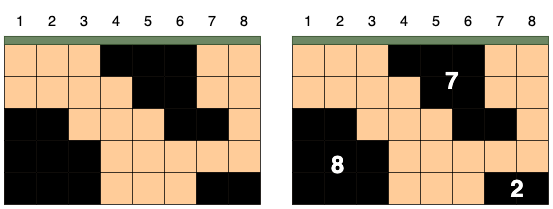
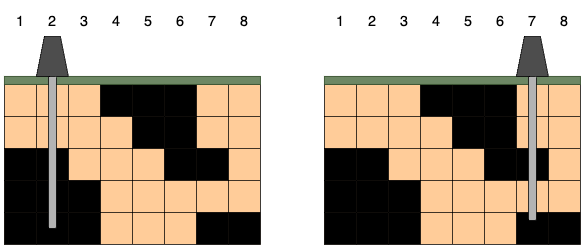
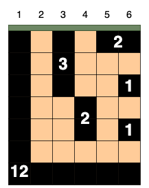

## 문제 설명
[본 문제는 정확성과 효율성 테스트 각각 점수가 있는 문제입니다.]

세로길이가 n 가로길이가 m인 격자 모양의 땅 속에서 석유가 발견되었습니다. 석유는 여러 덩어리로 나누어 묻혀있습니다. 당신이 시추관을 수직으로 단 하나만 뚫을 수 있을 때, 가장 많은 석유를 뽑을 수 있는 시추관의 위치를 찾으려고 합니다. 시추관은 열 하나를 관통하는 형태여야 하며, 열과 열 사이에 시추관을 뚫을 수 없습니다.



예를 들어 가로가 8, 세로가 5인 격자 모양의 땅 속에 위 그림처럼 석유가 발견되었다고 가정하겠습니다. 상, 하, 좌, 우로 연결된 석유는 하나의 덩어리이며, 석유 덩어리의 크기는 덩어리에 포함된 칸의 수입니다. 그림에서 석유 덩어리의 크기는 왼쪽부터 8, 7, 2입니다.



시추관은 위 그림처럼 설치한 위치 아래로 끝까지 뻗어나갑니다. 만약 시추관이 석유 덩어리의 일부를 지나면 해당 덩어리에 속한 모든 석유를 뽑을 수 있습니다. 시추관이 뽑을 수 있는 석유량은 시추관이 지나는 석유 덩어리들의 크기를 모두 합한 값입니다. 시추관을 설치한 위치에 따라 뽑을 수 있는 석유량은 다음과 같습니다.

| 시추관의 위치 | 획득한 덩어리 | 총 석유량 |
|---------------|--------------|-----------|
| 1             | [8]          | 8         |
| 2             | [8]          | 8         |
| 3             | [8]          | 8         |
| 4             | [7]          | 7         |
| 5             | [7]          | 7         |
| 6             | [7]          | 7         |
| 7             | [7, 2]       | 9         |
| 8             | [2]          | 2         |

오른쪽 그림처럼 7번 열에 시추관을 설치하면 크기가 7, 2인 덩어리의 석유를 얻어 뽑을 수 있는 석유량이 9로 가장 많습니다.

석유가 묻힌 땅과 석유 덩어리를 나타내는 2차원 정수 배열 land가 매개변수로 주어집니다. 이때 시추관 하나를 설치해 뽑을 수 있는 가장 많은 석유량을 return 하도록 solution 함수를 완성해 주세요.

## 제한 사항
- 1 ≤ land의 길이 = 땅의 세로길이 = n ≤ 500
    - 1 ≤ land[i]의 길이 = 땅의 가로길이 = m ≤ 500
    - land[i][j]는 i+1행 j+1열 땅의 정보를 나타냅니다.
    - land[i][j]는 0 또는 1입니다.
    - land[i][j]가 0이면 빈 땅을, 1이면 석유가 있는 땅을 의미합니다.
정확성 테스트 케이스 제한사항
- 1 ≤ land의 길이 = 땅의 세로길이 = n ≤ 100
    - 1 ≤ land[i]의 길이 = 땅의 가로길이 = m ≤ 100
효율성 테스트 케이스 제한사항
- 주어진 조건 외 추가 제한사항 없습니다.


## 입출력 예
|maps|answer|
|------|---|
|[[1,0,1,1,1],[1,0,1,0,1],[1,0,1,1,1],[1,1,1,0,1],[0,0,0,0,1]]|11|
|[[1,0,1,1,1],[1,0,1,0,1],[1,0,1,1,1],[1,1,1,0,0],[0,0,0,0,1]]|-1|

입출력 예 설명 <br>
**입출력 예 #1**

문제의 예시와 같습니다.

입출력 예 #2


시추관을 설치한 위치에 따라 뽑을 수 있는 석유는 다음과 같습니다.

시추관의 위치	획득한 덩어리	총 석유량
1	[12]	12
2	[12]	12
3	[3, 12]	15
4	[2, 12]	14
5	[2, 12]	14
6	[2, 1, 1, 12]	16
6번 열에 시추관을 설치하면 크기가 2, 1, 1, 12인 덩어리의 석유를 얻어 뽑을 수 있는 석유량이 16으로 가장 많습니다. 따라서 16을 return 해야 합니다.

## solution.java
``` java
import java.util.*;

class Solution {
    // 수직으로 단 하나만 뚫을 수 있을 때, 가장 많은 석유를 뽑을 수 있는 시추관의 위치를 찾으려고 한다
    // 시추관은 열 하나를 관통하는 형태
    // 시추관이 석유 덩어리의 일부를 지나면 해당 덩어리에 속한 모든 석유를 뽑을 수 있다
    // 뽑을 수 있는 석유량 = 시추관이 지나는 석유 덩어리들의 크기를 모두 합한 값
    
    // 시추관 하나를 설치해 뽑을 수 있는 가장 많은 석유량 구하기
    static int n, m, max = Integer.MIN_VALUE;
    static int[][] landNum;
    static Map<Integer, Integer> landSize = new HashMap<>();
    static int[] dx = {-1, 1, 0, 0};
    static int[] dy = {0, 0, -1, 1};
    
    public int solution(int[][] land) {
        n = land.length;
        m = land[0].length;
        
        landNum = new int[n][m];
        int num = 1;
        for (int i = 0; i < n; i++) {
            for (int j = 0; j < m; j++) {
                if (land[i][j] == 1 && landNum[i][j] == 0) {
                    mark(land, i, j, num++);
                }
            }
        }
        
        for (int col = 0; col < m; col++) {
            findMax(col);
        }
        return max;
    }
    
    private static void mark(int[][] land, int startX, int startY, int num) {
        ArrayDeque<int[]> queue = new ArrayDeque<>();
        
        int size = 1;
        landNum[startX][startY] = num;
        queue.add(new int[] {startX, startY});
        
        while (!queue.isEmpty()) {
            int[] current = queue.poll();
            
            for (int d = 0; d < 4; d++) {
                int nx = current[0] + dx[d];
                int ny = current[1] + dy[d];
                
                if (!isValid(nx, ny)) continue;
                if (landNum[nx][ny] != 0) continue; // 이미 방문한 경우
                if (land[nx][ny] == 1) {
                    landNum[nx][ny] = num;
                    queue.add(new int[] {nx, ny});
                    size++;
                }
            }
        }
        landSize.put(num, size);
    }
    
    private static boolean isValid(int x, int y) {
        return x >= 0 && x < n && y >= 0 && y < m;
    }
    
    private static void findMax(int col) {
        int sum = 0;
        Set<Integer> visited = new HashSet<>();
        
        for (int i = 0; i < n; i++) {
            int num = landNum[i][col];
            if(num != 0 && !visited.contains(num)) {
                visited.add(num);
                sum += landSize.get(num);
            }
        }
        max = Math.max(max, sum);
    }
}
```