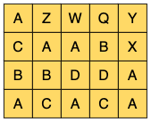
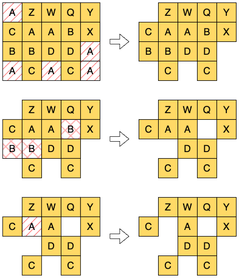
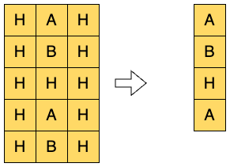

## 문제 설명
A 회사의 물류창고에는 알파벳 대문자로 종류를 구분하는 컨테이너가 세로로 n 줄, 가로로 m줄 총 n x m개 놓여 있습니다. 특정 종류 컨테이너의 출고 요청이 들어올 때마다 지게차로 창고에서 접근이 가능한 해당 종류의 컨테이너를 모두 꺼냅니다. 접근이 가능한 컨테이너란 4면 중 적어도 1면이 창고 외부와 연결된 컨테이너를 말합니다.

최근 이 물류 창고에서 창고 외부와 연결되지 않은 컨테이너도 꺼낼 수 있도록 크레인을 도입했습니다. 크레인을 사용하면 요청된 종류의 모든 컨테이너를 꺼냅니다.



위 그림처럼 세로로 4줄, 가로로 5줄이 놓인 창고를 예로 들어보겠습니다. 이때 "A", "BB", "A" 순서대로 해당 종류의 컨테이너 출고 요청이 들어왔다고 가정하겠습니다. “A”처럼 알파벳 하나로만 출고 요청이 들어올 경우 지게차를 사용해 출고 요청이 들어온 순간 접근 가능한 컨테이너를 꺼냅니다. "BB"처럼 같은 알파벳이 두 번 반복된 경우는 크레인을 사용해 요청된 종류의 모든 컨테이너를 꺼냅니다.



위 그림처럼 컨테이너가 꺼내져 3번의 출고 요청 이후 남은 컨테이너는 11개입니다. 두 번째 요청은 크레인을 활용해 모든 B 컨테이너를 꺼냈음을 유의해 주세요. 세 번째 요청이 들어왔을 때 2행 2열의 A 컨테이너만 접근이 가능하고 2행 3열의 A 컨테이너는 접근이 불가능했음을 유의해 주세요.

처음 물류창고에 놓인 컨테이너의 정보를 담은 1차원 문자열 배열 storage와 출고할 컨테이너의 종류와 출고방법을 요청 순서대로 담은 1차원 문자열 배열 requests가 매개변수로 주어집니다. 이때 모든 요청을 순서대로 완료한 후 남은 컨테이너의 수를 return 하도록 solution 함수를 완성해 주세요.

## 제한 사항
- 2 ≤ storage의 길이 = n ≤ 50
    - 2 ≤ storage[i]의 길이 = m ≤ 50
        - storage[i][j]는 위에서 부터 i + 1번째 행 j + 1번째 열에 놓인 컨테이너의 종류를 의미합니다.
        - storage[i][j]는 알파벳 대문자입니다.
- 1 ≤ requests의 길이 ≤ 100
    - 1 ≤ requests[i]의 길이 ≤ 2
    - requests[i]는 한 종류의 알파벳 대문자로 구성된 문자열입니다.
    - requests[i]의 길이가 1이면 지게차를 이용한 출고 요청을, 2이면 크레인을 이용한 출고 요청을 의미합니다.

## 테스트 케이스 구성 안내
아래는 테스트 케이스 구성을 나타냅니다. 각 그룹 내의 테스트 케이스를 모두 통과하면 해당 그룹에 할당된 점수를 획득할 수 있습니다.

| 그룹 | 총점 | 추가 제한 사항                                      |
|------|------|-----------------------------------------------------|
| #1   | 10%  | requests에 크레인을 사용한 출고 요청만 존재합니다.  |
| #2   | 15%  | requests에 지게차를 사용한 출고 요청만 존재합니다.  |
| #3   | 25%  | requests에 컨테이너의 종류가 최대 한 번씩 등장합니다. 즉, 이전에 꺼낸 컨테이너 종류를 다시 꺼내지 않습니다. |
| #4   | 50%  | 제한사항 외 추가조건이 없습니다.                    |


## 입출력 예
| storage                           | requests                   | result |
|-----------------------------------|----------------------------|--------|
| ["AZWQY", "CAABX", "BBDDA", "ACACA"] | ["A", "BB", "A"]           | 11     |
| ["HAH", "HBH", "HHH", "HAH", "HBH"] | ["C", "B", "B", "B", "B", "H"] | 4      |


## 입출력 예 설명 

**입출력 예 #1**

문제 설명의 예시와 같습니다.

**입출력 예 #2**



창고의 초기 상태와 모든 요청을 수행한 뒤의 상태입니다. 남은 컨테이너의 수인 4를 return 해야 합니다.

## solution.java
``` java
import java.util.*;

class Solution {
    // 요청 -> 지게차로 창고에서 접근이 가능한 해당 종류의 컨테이너를 모두 꺼냄
    // 접근이 가능한 컨테이너란 : 4면 중 적어도 1면이 창고 외부와 연결된 컨테이너
    // 크레인을 사용하면 요청된 종류의 모든 컨테이너를 꺼냄
    // 알파벳 하나 -> 지게차, 알파벳 두 번 반복 -> 크레인
    // 모든 요청을 순서대로 완료한 후 남은 컨테이너의 수를 return
    
    static int N, M, totalContainer;
    static char[][] Storage;
    static int[] dx = {-1, 1, 0, 0};
    static int[] dy = {0, 0, -1, 1};
    
    public int solution(String[] storage, String[] requests) {
        N = storage.length;
        M = storage[0].length();
        Storage = new char[N][M];
        totalContainer = 0;
        
        initStorage(storage);
        
        for (String request : requests) {
            if (request.length() == 1) {
                char[][] copied = deepCopy(Storage);
                truck(request, copied);
            } else if (request.length() == 2) {
                crane(request);
            }
        }
        return totalContainer;
    }
    
    private static void initStorage(String[] storage) {
        for (int i = 0; i < N; i++) {
            for (int j = 0; j < M; j++) {
                Storage[i][j] = storage[i].charAt(j);
                totalContainer++;
            }
        }
    }
    
    private static char[][] deepCopy(char[][] origin) {
        char[][] copy = new char[N][M];
        for (int i = 0; i < N; i++) {
            copy[i] = origin[i].clone();
        }
        return copy;
    }
    
    private static void truck(String request, char[][] copied) {
        for (int i = 0; i < N; i++) {
            for (int j = 0; j < M; j++) {
                if (isAccessible(i, j) && Storage[i][j] == request.charAt(0)) {
                    copied[i][j] = '0';
                    totalContainer--;
                }
            }
        }
        Storage = copied;
    }

    private static void crane(String request) {
        for (int i = 0; i < N; i++) {
            for (int j = 0; j < M; j++) {
                if (Storage[i][j] == request.charAt(0)) {
                    Storage[i][j] = '0';
                    totalContainer--;
                }
            }
        }
    }
    
    private static boolean isAccessible(int startX, int startY) {
        boolean[][] visited = new boolean[N][M];
        ArrayDeque<int[]> queue = new ArrayDeque<>();
        
        queue.add(new int[] {startX, startY});
        visited[startX][startY] = true;
        
        while (!queue.isEmpty()) {
            int[] current = queue.poll();
            int x = current[0], y = current[1];
            if (isBoundary(x, y)) return true;
            
            for (int d = 0; d < 4; d++) {
                int nx = x + dx[d];
                int ny = y + dy[d];
                if (isValid(nx, ny) && !visited[nx][ny] && Storage[nx][ny] == '0') {
                    queue.add(new int[] {nx, ny});
                    visited[nx][ny] = true;
                }
            }
        }
        return false;
    }
    
    private static boolean isValid(int x, int y) {
        return x >= 0 && x < N && y >= 0 && y < M;
    }
    
    private static boolean isBoundary(int x, int y) {
        return x == 0 || x == N - 1 || y == 0 || y == M - 1;
    }
}
```