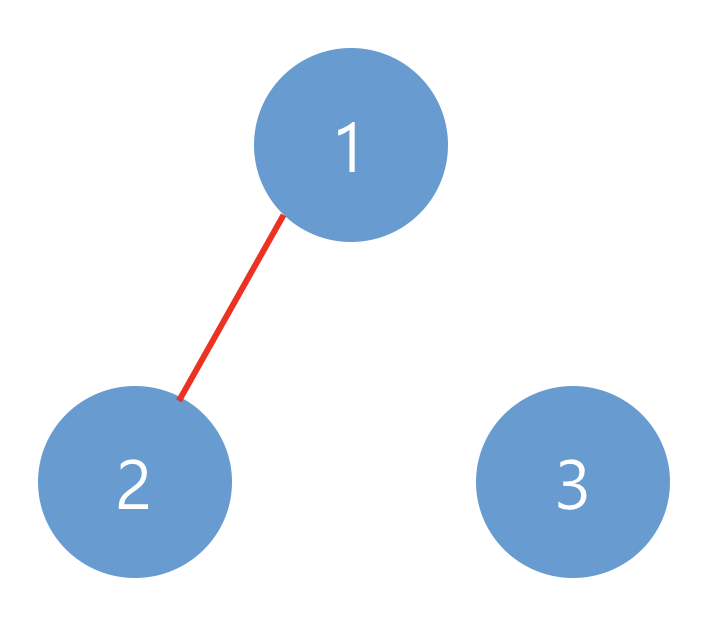
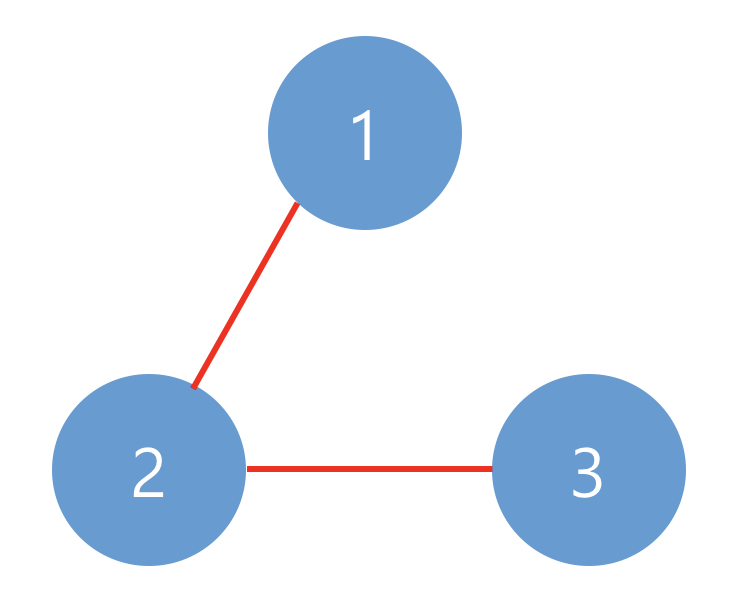

## 문제 설명
네트워크란 컴퓨터 상호 간에 정보를 교환할 수 있도록 연결된 형태를 의미합니다. 예를 들어, 컴퓨터 A와 컴퓨터 B가 직접적으로 연결되어있고, 컴퓨터 B와 컴퓨터 C가 직접적으로 연결되어 있을 때 컴퓨터 A와 컴퓨터 C도 간접적으로 연결되어 정보를 교환할 수 있습니다. 따라서 컴퓨터 A, B, C는 모두 같은 네트워크 상에 있다고 할 수 있습니다.

컴퓨터의 개수 n, 연결에 대한 정보가 담긴 2차원 배열 computers가 매개변수로 주어질 때, 네트워크의 개수를 return 하도록 solution 함수를 작성하시오.

## 제한 사항
- 컴퓨터의 개수 n은 1 이상 200 이하인 자연수입니다.
- 각 컴퓨터는 0부터 n-1인 정수로 표현합니다.
- i번 컴퓨터와 j번 컴퓨터가 연결되어 있으면 computers[i][j]를 1로 표현합니다.
- computer[i][i]는 항상 1입니다.

## 입출력 예
|n|computers|return|
|------|---|---|
|3|[[1, 1, 0], [1, 1, 0], [0, 0, 1]]|2|
|3|[[1, 1, 0], [1, 1, 1], [0, 1, 1]]|1|

입출력 예 설명 <br>
예제 #1 <br>
아래와 같이 2개의 네트워크가 있습니다.


예제 #2 <br>
아래와 같이 1개의 네트워크가 있습니다.


## solution.py
``` python
def solution(n, computers):
    visited = [False] * n
    count = 0
    
    def dfs(computer_num):
        stack = [computer_num]
        while stack:
            current = stack.pop()

            if not visited[current]:
                visited[current] = True

            for i in range(n):
                is_connected = computers[current][i]

                if not visited[i] and is_connected:
                    visited[i] = True
                    stack.append(i)

    for i in range(n):
        if not visited[i]:
            dfs(i)
            count += 1
    return count
```

## 문제 풀이
- for문을 돌면서 방문하지 않은 새 네트워크를 dfs 함수를 통해 탐색함
- dfs에서는 특정 컴퓨터에서 시작해 그와 연결된 모든 컴퓨터를 탐색함
    이 함수는 스택을 사용하여 연결된 모든 컴퓨터를 차례로 방문함
- dfs 호출 후 `count += 1`하는 이유
    - dfs 함수는 i번 컴퓨터에서 시작하여 해당 네트워크의 모든 컴퓨터를 방문 처리함
    - dfs가 끝나면, i번 컴퓨터가 속한 하나의 네트워크가 모두 탐색된 상태임
    - 따라서 새로운 네트워크가 완전히 탐색된 후 count += 1을 하여 네트워크의 수를 기록함