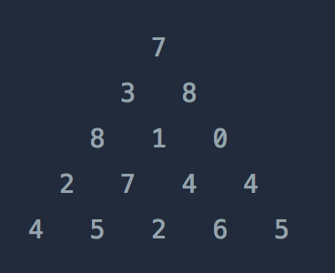

## 문제 설명

위와 같은 삼각형의 꼭대기에서 바닥까지 이어지는 경로 중, 거쳐간 숫자의 합이 가장 큰 경우를 찾아보려고 합니다. 아래 칸으로 이동할 때는 대각선 방향으로 한 칸 오른쪽 또는 왼쪽으로만 이동 가능합니다. 예를 들어 3에서는 그 아래칸의 8 또는 1로만 이동이 가능합니다.

삼각형의 정보가 담긴 배열 triangle이 매개변수로 주어질 때, 거쳐간 숫자의 최댓값을 return 하도록 solution 함수를 완성하세요.

## 제한 사항
- 삼각형의 높이는 1 이상 500 이하입니다.
- 삼각형을 이루고 있는 숫자는 0 이상 9,999 이하의 정수입니다.

## 입출력 예
|triangle|result|
|---|---|	
|[[7], [3, 8], [8, 1, 0], [2, 7, 4, 4], [4, 5, 2, 6, 5]]|30|

## solution.py
``` python
def solution(triangle):

    dp = [[0] * len(row) for row in triangle]
    dp[0][0] = triangle[0][0]
    
    for i in range(1, len(triangle)):
        for j in range(len(triangle[i])):
            if j == 0: # 왼쪽 가장자리
                dp[i][j] = dp[i - 1][j] + triangle[i][j]
            elif j == len(triangle[i]) - 1: # 오른쪽 가장자리
                dp[i][j] = dp[i - 1][j - 1] + triangle[i][j]
            else: # 가운데
                dp[i][j] = max(dp[i - 1][j - 1], dp[i - 1][j]) + triangle[i][j]

    # 마지막 층에서 최대값 반환
    return max(dp[-1])
```

- 출력 예시
``` python
[[7], [10, 15], [18, 16, 15], [20, 25, 20, 19], [24, 30, 27, 26, 24]]
```