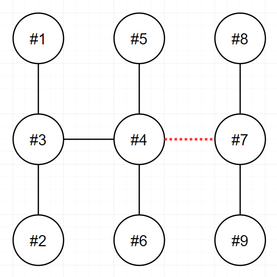
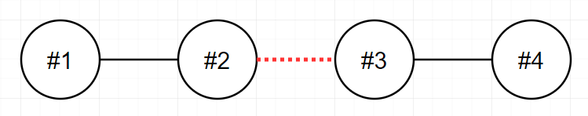
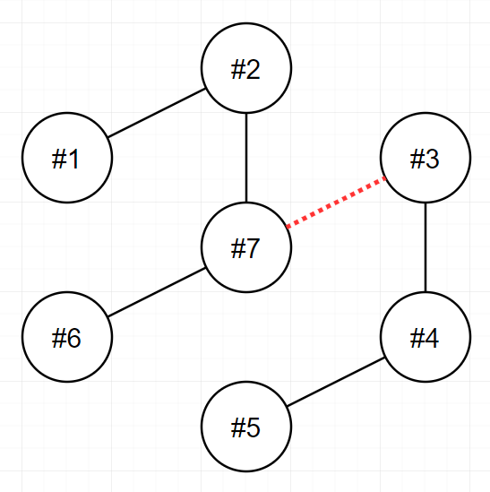

## 문제 설명
n개의 송전탑이 전선을 통해 하나의 트리 형태로 연결되어 있습니다. 당신은 이 전선들 중 하나를 끊어서 현재의 전력망 네트워크를 2개로 분할하려고 합니다. 이때, 두 전력망이 갖게 되는 송전탑의 개수를 최대한 비슷하게 맞추고자 합니다.

송전탑의 개수 n, 그리고 전선 정보 wires가 매개변수로 주어집니다. 전선들 중 하나를 끊어서 송전탑 개수가 가능한 비슷하도록 두 전력망으로 나누었을 때, 두 전력망이 가지고 있는 송전탑 개수의 차이(절대값)를 return 하도록 solution 함수를 완성해주세요.

## 제한 사항
- n은 2 이상 100 이하인 자연수입니다.
- wires는 길이가 n-1인 정수형 2차원 배열입니다.
  - wires의 각 원소는 [v1, v2] 2개의 자연수로 이루어져 있으며, 이는 전력망의 v1번 송전탑과 v2번 송전탑이 전선으로 연결되어 있다는 것을 의미합니다.
  - 1 ≤ v1 < v2 ≤ n 입니다.
  - 전력망 네트워크가 하나의 트리 형태가 아닌 경우는 입력으로 주어지지 않습니다.

## 입출력 예
|n|wires|result|
|------|---|---|
|9|[[1,3],[2,3],[3,4],[4,5],[4,6],[4,7],[7,8],[7,9]]|3|
|4|[[1,2],[2,3],[3,4]]|0|
|7|[[1,2],[2,7],[3,7],[3,4],[4,5],[6,7]]|1|

입출력 예 설명<br>

입출력 예 #1<br>

- 다음 그림은 주어진 입력을 해결하는 방법 중 하나를 나타낸 것입니다.



- 4번과 7번을 연결하는 전선을 끊으면 두 전력망은 각 6개와 3개의 송전탑을 가지며, 이보다 더 비슷한 개수로 전력망을 나눌 수 없습니다.
- 또 다른 방법으로는 3번과 4번을 연결하는 전선을 끊어도 최선의 정답을 도출할 수 있습니다.

입출력 예 #2<br>
- 다음 그림은 주어진 입력을 해결하는 방법을 나타낸 것입니다.


- 2번과 3번을 연결하는 전선을 끊으면 두 전력망이 모두 2개의 송전탑을 가지게 되며, 이 방법이 최선입니다.

입출력 예 #3<br>

- 다음 그림은 주어진 입력을 해결하는 방법을 나타낸 것입니다.


- 3번과 7번을 연결하는 전선을 끊으면 두 전력망이 각각 4개와 3개의 송전탑을 가지게 되며, 이 방법이 최선입니다.

## solution.java
``` java
import java.util.*;

class Solution {
    // n은 2 이상 100 이하인 자연수 -> 완전탐색
    // 송전탑 개수가 가능한 비슷하도록 두 전력망으로 나누기
    // 두 전력망이 가지고 있는 송전탑 개수의 차이(절대값) 반환하기
    
    static int N;
    static int min = Integer.MAX_VALUE;
    static List<Integer>[] edges;
    public int solution(int n, int[][] wires) {
        N = n;
        edges = new ArrayList[N + 1];
        for (int i = 1; i <= N; i++) {
            edges[i] = new ArrayList<>();
        }
        
        for (int[] wire : wires) {
            edges[wire[0]].add(wire[1]);
            edges[wire[1]].add(wire[0]);
        }
        
        for (int[] wire : wires) {
            // edge 중 하나 선택해서 없애기
            // 연결되어있는지 확인 후 차이 저장 (차이가 min이어야 함)
            // 없앴던 edge 원복하기
            
            int start = wire[0];
            int end = wire[1];
            
            edges[start].remove(Integer.valueOf(end));
            edges[end].remove(Integer.valueOf(start));
            
            int cnt1 = bfs(start);  // start 또는 end가 와도 상관 없음
            int cnt2 = N - cnt1;
            min = Math.min(min, Math.abs(cnt1 - cnt2));
            
            
            edges[start].add(end);
            edges[end].add(start);
        }
        
        return min;
    }
    
    private static int bfs(int start) {
        boolean[] visited = new boolean[N + 1];
        ArrayDeque<Integer> queue = new ArrayDeque<>();
        
        queue.add(start);
        visited[start] = true;
        
        int count = 1;
        while (!queue.isEmpty()) {
            int current = queue.poll();
            
            for (int next : edges[current]) {
                if (visited[next]) continue;
                queue.add(next);
                visited[next] = true;
                count++;
            }
        }
        return count;
    }
}
```

## 주의할 점
``` java
list.remove(2); -> 인덱스 2번 요소를 삭제한다는 뜻
```
하지만 지금 내가 하고 싶은 건 `값이 2인 요소를 삭제`하는 것이다.
→ 이럴 때 list.remove(Integer.valueOf(2));로 명확하게 객체로 전달해야
→ remove(Object o)가 호출돼서 값 2를 삭제하는 게 된다.

## 정리
- int → Integer (객체형으로 바꾸기)
``` java
Integer.valueOf(b)
```
- 인덱스 2번 삭제
``` java
list.remove(2)	
```
- 값이 2인 요소 삭제
``` java
list.remove(Integer.valueOf(2))
```