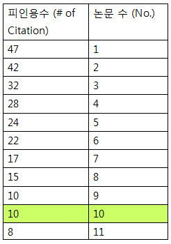

## 문제 설명
H-Index는 과학자의 생산성과 영향력을 나타내는 지표입니다. 어느 과학자의 H-Index를 나타내는 값인 h를 구하려고 합니다. 위키백과1에 따르면, H-Index는 다음과 같이 구합니다.

어떤 과학자가 발표한 논문 n편 중, h번 이상 인용된 논문이 h편 이상이고 나머지 논문이 h번 이하 인용되었다면 h의 최댓값이 이 과학자의 H-Index입니다.

어떤 과학자가 발표한 논문의 인용 횟수를 담은 배열 citations가 매개변수로 주어질 때, 이 과학자의 H-Index를 return 하도록 solution 함수를 작성해주세요.

## 제한 사항
- 과학자가 발표한 논문의 수는 1편 이상 1,000편 이하입니다.
- 논문별 인용 횟수는 0회 이상 10,000회 이하입니다.

## 입출력 예
|citations|return|
|------|---|
|[3, 0, 6, 1, 5]|3|

입출력 예 설명<br>
이 과학자가 발표한 논문의 수는 5편이고, 그중 3편의 논문은 3회 이상 인용되었습니다. 그리고 나머지 2편의 논문은 3회 이하 인용되었기 때문에 이 과학자의 H-Index는 3입니다.

## solution.java
``` java
import java.util.*;

class Solution {
    public int solution(int[] citations) {
        Arrays.sort(citations);
        int n = citations.length;
        
        for (int i = 0; i < n; i++) {
            int h = n - i; // 현재 인덱스에서 뒤쪽 논문 수
            if (citations[i] >= h) {
                return h;
            }
        }
        return 0;
    }
}
```

## 문제 이해하기
- H-지수 구하는 방법
  - 나의 h는 어떻게 구할 수 있을까? 표와 같이 자신이 저널에 등재한 전체 논문중 많이 인용된 순으로 정렬한 후, 피인용수가 논문수와 같아지거나 피인용수가 논문수보다 작아지기 시작하는 숫자가 H-지수가 된다. 이 표에서는 10이 H-지수가 된다. 다시 말하여, 이 연구원은 논문 인용횟수가 10이 넘는 논문이 적어도 10편이 된다는 것을 의미한다.
  